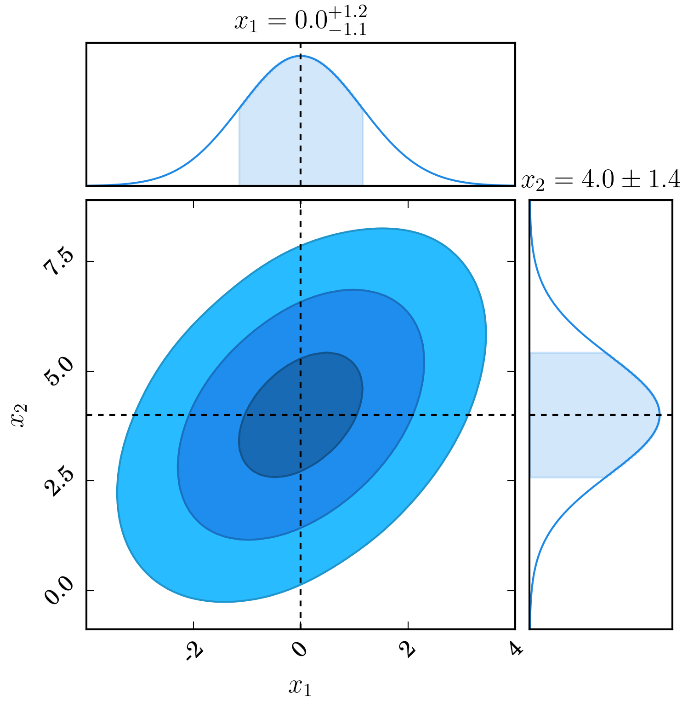

# [ChainConsumer](https://samreay.github.io/ChainConsumer)

[](https://travis-ci.org/Samreay/ChainConsumer)
[](https://coveralls.io/github/Samreay/ChainConsumer?branch=master)
[](https://github.com/dessn/abc/blob/master/LICENSE)
[](https://pypi.python.org/pypi/ChainConsumer)
[](https://zenodo.org/badge/latestdoi/23430/Samreay/ChainConsumer)
[](http://dx.doi.org/10.21105/joss.00045)

A new library to consume your fitting chains! Produce likelihood surfaces,
plot your walks to check convergence, or even output a LaTeX table of the
marginalised parameter distributions with uncertainties and significant
figures all done for you!

[Click through to the online documentation](https://samreay.github.io/ChainConsumer)

```python
import numpy as np
from chainconsumer import ChainConsumer

mean = [0.0, 4.0]
data = np.random.multivariate_normal(mean, [[1.0, 0.7], [0.7, 1.5]], size=100000)

c = ChainConsumer()
c.add_chain(data, parameters=["$x_1$", "$x_2$"])
c.plot(filename="example.png", figsize="column", truth=mean)
```




You can plot walks:

```
c.plot_walks(filename="walks.png")
```


And finally, you can also create LaTeX tables:

```
print(c.get_latex_table())
```

Which compiles to something as shown below:


-----------

### Installation

Install via `pip`:
    
    pip install chainconsumer


----------

## Contributing

Users that wish to contribute to this project may do so in a number of ways.
Firstly, for any feature requests, bugs or general ideas, please raise an issue
via [Github](https://github.com/samreay/ChainConsumer/issues).

If you wish to contribute code to the project, please simple fork the project on
Github and then raise a pull request. Pull requests will be reviewed to determine
whether the changes are major or minor in nature, and to ensure all changes are tested.

----------

## Citing

For those that use ChainConsumer and would like to reference it, the
following BibTeX is generated from the JOSS article:

```
@article{Hinton2016,
  doi = {10.21105/joss.00045},
  url = {http://dx.doi.org/10.21105/joss.00045},
  year  = {2016},
  month = {aug},
  publisher = {The Open Journal},
  volume = {1},
  number = {4},
  author = {Samuel Hinton},
  title = {{ChainConsumer}},
  journal = {{JOSS}}
}
```

----------

Please feel free to fork the project and open pull-requests, or
raise an issue via Github if any bugs are encountered or 
features requests thought up.

### Update History

##### 0.10.1
* Updating setup so that dependencies are automatically installed.

##### 0.10.0
* Modifying the ``add_chain`` API, so that you can pass dictionaries!

##### 0.9.10
* Smarter extent tick labels and offsets.
* Adding list based line styles, widths, shading and opacity.
* Adding two more examples.

##### 0.9.9
* Preconfiguring logging.

##### 0.9.8
* Adding 2D Gaussian smoothing for the contour surfaces.
* Renaming ``contourf`` and ``contourf_alpha`` to ``shade`` and ``shade_alpha``.
* Updating some of the example plots.

##### 0.9.7
* Updating package setup scripts.

##### 0.9.6
* Updating package setup scripts.


##### 0.9.5
* Adding markdown paper.

##### 0.9.4
* Updating setup and package details

##### 0.9.3
* Initial zenodo release

##### 0.9.2
* Adding in smoothing, making it default
* Adding extra example to show how to remove smoothing.

##### 0.9.1
* Adding in tests

##### 0.9.0
* Initial PyPi push