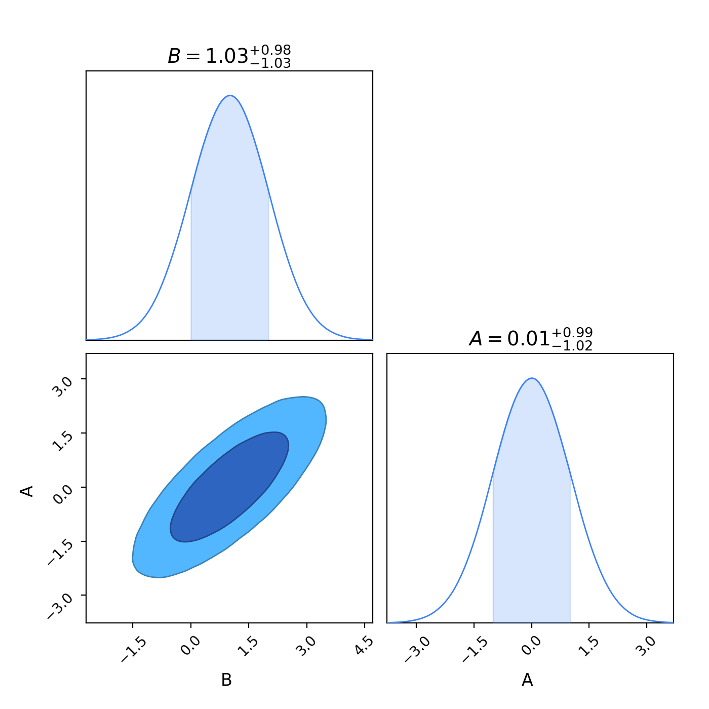

# ChainConsumer


ChainConsumer is a python package designed to do one thing - consume the chains output from Monte Carlo processes like MCMC. ChainConsumer can utilise these chains to produce plots of the posterior surface inferred from the chain distributions, to plot the chains as walks (to check for mixing and convergence), and to output parameter summaries in the form of LaTeX tables. On top of all of this, if you have multiple models (chains), you can load them all in and perform some model comparison using AIC, BIC or DIC metrics.

## Older Versions

For those using older versions of ChainConsumer, you can find a copy of the old documentation using the wayback machine.

* [Link 1](https://web.archive.org/web/20220616191528/https://samreay.github.io/ChainConsumer/)
* [Link 2](https://web.archive.org/web/20220327090418/https://samreay.github.io/ChainConsumer/)
* [Link 3](https://web.archive.org/web/20220816010459/https://samreay.github.io/ChainConsumer/)

## Installation

The latest version of ChainConsumer requires at least Python 3.10. If you have a version of `ChainConsumer` that is older (v0.34.0 or below)
you will find this documentation not very useful.

`pip install chainconsumer`

## Basic Example

If you have some samples, analysing them should be straightforward:

```python
from chainconsumer import Chain, ChainConsumer, make_sample


df = make_sample()
c = ChainConsumer()
c.add_chain(Chain(samples=df, name="An Example Contour"))
fig = c.plotter.plot()
```




## Common Issues

Users on some Linux platforms have reported issues rendering plots using ChainConsumer. The common error states that `dvipng: not found`, and as per this [StackOverflow](http://stackoverflow.com/a/32915992/3339667)
post, it can be solved by explicitly installing the `matplotlib` dependency `dvipng` via `sudo apt-get install dvipng`.

If you are running on HPC or clusters where you can't install things yourself,
users may run into issues where LaTeX or other optional dependencies aren't installed. In this case, ensure `usetex=False` in your `PlotConfig` (which is the default). If this does not work, also set `serif=False`, which has helped some uses.

## Citing


You can cite ChainConsumer using the following BibTeX:

```bash
   @ARTICLE{Hinton2016,
      author = {{Hinton}, S.~R.},
       title = "{ChainConsumer}",
     journal = {The Journal of Open Source Software},
        year = 2016,
       month = aug,
      volume = 1,
         eid = {00045},
       pages = {00045},
         doi = {10.21105/joss.00045},
      adsurl = {http://adsabs.harvard.edu/abs/2016JOSS....1...45H},
   }
```

## Contributing


Users that wish to contribute to this project may do so in a number of ways.
Firstly, for any feature requests, bugs or general ideas, please raise an issue via [Github](https://github.com/samreay/ChainConsumer/issues).

If you wish to contribute code to the project, please simple fork the project on Github and then raise a pull request. Pull requests will be reviewed to determine whether the changes are major or minor in nature, and to ensure all changes are tested.

After cloning down the project, run `make install` to install all dependencies and pre-commit hook.