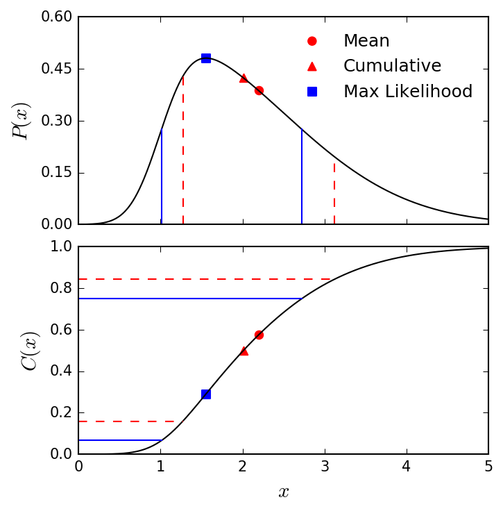

# Usage

In general, this is the flow:

1. Get your samples into a pandas dataframe. If you have another format and want to contribute a translation function, that would be amazing.
2. Turn those samples into a `Chain`. At this point, you can specify a ton of visual and statistical choices.
3. Give those chains to `ChainConsumer`
4. If you know the truth value of the chains, you can call `c.add_truth(Truth(...))` to add this to your plots. Note you can have as many truth lines as you want, not just one.
5. If you want to change plotting specific options (but not chain specific options), you can `set_plot_config(PlotConfig(...))` to control things like the number of ticks, font size, etc.
6. Optionally, use the diagnostics available to see if your chains are stable, or do this via using `plot_walks`
7. Make your contours via `plot`, or your summaries, or your LaTeX tables.


## Statistics

When summarising chains, ChainConsumer offers several different methods. The below image shows the upper and lower bounds and central points for the "MEAN", "CUMULATIVE", and "MAX" methods respectively. The "MAX_CENTRAL" method is the blue central value and the red bounds.



::: chainconsumer.statistics.SummaryStatistic

## Why all these classes and not just kwargs?

Python type hinting for kwargs isn't quite there yet. `TypedDict` with Python 3.12 is a big step forward,
but I know it'll be a while before the scientific community is all on 3.12. The initial version of ChainConsumer,
which was Python 2.7 compatible, didn't have type hints at all. It just took tons of kwargs and passed them around,
which also caused a huge ton of duplicated docstring and functions. By encapsulating the options into a dataclass,
it becomes much easier for anyone, me or someone who wants to contribute to the repo, to simply add to this class.

You don't need to remember to update five other functions, and their docstring. I like that. I *don't* like the extra
verbosity, but it's a price I'm willing to pay for more explicit code and better type hinting.

## How to do overrides

When you make a Chain, you specify its initial properties.

```python
c = ChainConsumer()
chain = Chain(samples=df, name="Something", shade=True, plot_point=True, color="red")
c.add_chain(c)
```

If you then tell `ChainConsumer` to add an override, this will then replace your original value, for all chains.

```python
c.add_override(ChainConfig(shade=False))
```

I note that this override does not modify your original chain. When the plotting code requests final chains from `ChainConsumer`, the initial chains are copied and their attributes updated by the override.